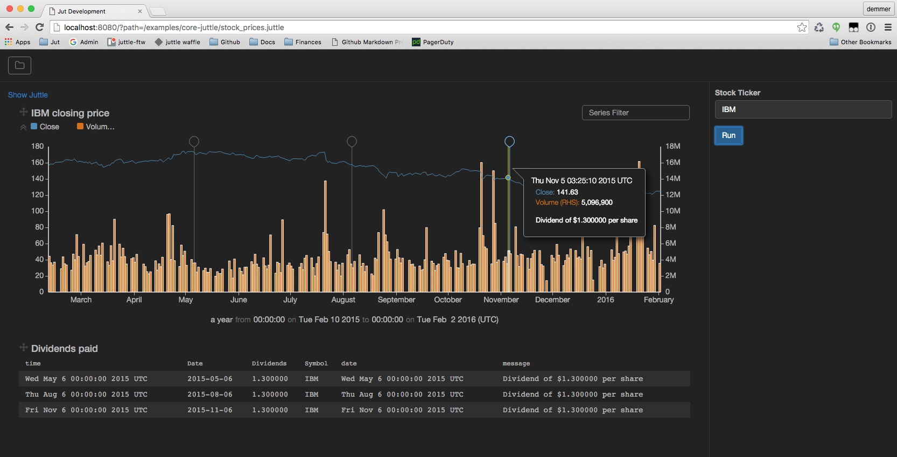

# Juttle Engine

[](https://travis-ci.org/juttle/juttle-engine)

Juttle Engine is an integrated environment for developing and executing
[juttle](https://github.com/juttle/juttle) programs and visualizations. It lets
you run Juttle programs stored on the file system and present the results in a
browser for experimentation, development, deployment, and debugging of juttle
programs.



To make it easy to interconnect analytics with visualization,
Juttle promotes a tight coupling between the language and the client-side
visualization library.  Rather than
having to tie together by hand a data processing layer with a separate
visualization layer, Juttle enables you to integrate these two layers
so you don't have to worry about the details
of wiring Juttle dataflow computation to your browser-based views.
Juttle Engine is the development and execution environment in which you can
explore your data using Juttle and deploy rich visualizations into production.

Under the covers, Juttle Engine integrates
[juttle-service](https://github.com/juttle/juttle-service), a node.js API server
that enables execution of Juttle programs using a REST API with the ability to
serve web application bundles. It comes with the
[juttle-viewer](https://github.com/juttle/juttle-viewer) application that
provides a simple in browser experience for loading and executing juttle
programs in the juttle-engine and rendering the results using the
[juttle-viz](https://github.com/juttle/juttle-viz) visualization library. In the
future, Juttle Engine may be extended to support other application bundles.

## Getting Started

### Installation

Make sure you have [node](http://nodejs.org) (with [npm](http://npmjs.org)) installed.

Use npm to install Juttle Engine
```
$ npm install juttle-engine
```

This will install the Juttle Engine daemon and client binaries, the [juttle](http://github.com/juttle/juttle) interpreter, and the current set of supported juttle adapters.

We believe it to work with node.js 4.2.3 and 5.0, npm 2.14.17 and 3.5, and likely other combinations we have not tested against.

### Running your first juttle program

Start the daemon by running juttle-engine:
```
$ juttle-engine -d -o juttle-engine.log
```
This will daemonize juttle-engine and output logs to juttle-engine.log. You can now run juttle programs against the juttle-engine daemon via the juttle-engine-client:
```
$ juttle-engine-client browser --path examples/core-juttle/hello_world.juttle
```
This will open a browser window and display the output of the program. You can make edits to your juttle, save the file, and reload the browser window to get the updated output.

### Examples

Several demo-style examples of Juttle programs with sample data sets are available in this repo under [examples](./examples/README.md). The same examples are deployed on a demo system [demo.juttle.io](http://demo.juttle.io/index.html).

We also offer a [tutorial](http://juttle.github.io/juttle/concepts/juttle_tutorial) for developers new to Juttle.

## Ecosystem

Here's how the juttle-engine module fits into the overall [Juttle Ecosystem](https://github.com/juttle/juttle/blob/master/docs/juttle_ecosystem.md):

[](https://github.com/juttle/juttle/blob/master/docs/juttle_ecosystem.md)

## Options and Configuration

Here are the full command line options supported by the daemon and client programs:

### juttle-engine

```
usage: [--port <port>] [--root <path>]
       [--config <juttle-config-path>] [--daemonize]
       [--output <logfile>] [--log-config <log4js-config-path>]
       [--log-level <level] [--help]
       -p, --port <port>:                     Run juttle-engine on specified port
       -r, --root <path>:                     Use <path> as the root directory for juttle programs
       -c, --config <juttle-config-path>:     Read juttle config from <juttle-config-path>
       -d, --daemonize:                       Daemonize juttle-engine and log to configured log file
       -o, --output <logfile>:                Log to specififed file when daemonized
       -L, --log-config <log4js-config-path>: Configure logging from <log4js-config-path>. Overrides any value of -o
       -l, --log-level <level>:               Use a default log level of <level>. Overridden by any log level specified in -L
       -h, --help:                            Print this help and exit');
```

``juttle-engine`` uses log4js for logging and by default logs to ``log/juttle-engine.log``.

### juttle-engine-client

```
usage: [--juttle-engine <hostname:port>] [--help] [COMMAND] [OPTIONS]
     [COMMAND]: one of the following, with the following options:
          subscribe (--job <job-id> | --observer <observer-id>)
          list_jobs [--job <job-id>]
          list_observers
          run --path <path-to-juttle-file> [--wait] [--observer <observer-id>]
          delete --job <job-id>
          get_inputs --path <path-to-juttle-file> --input name=val [--input name=val ...]
          push --path <path-to-juttle-file> [--topic <rendezvous-topic>]
          watch --path <path-to-juttle-file> [--topic <rendezvous-topic>]
          browser --path <path-to-juttle-file>
     [OPTIONS]: one of the following:
          --path <path-to-juttle-file>                 Path to file relative to configured root directory.
                                                       used by: run,get_inputs,push,watch,browser
          --wait                                       If true, wait for program to finish, otherwise run in background
                                                       used by: run
          --input name=val                             One or more input values.
                                                       used by: get_inputs
          --job <job-id>                               Job id.
                                                       used by: subscribe,list_jobs,delete
          --observer <observer-id>                     Observer id.
                                                       used by: subscribe,run
          --juttle-engine <hostname:port>              Hostname/port of server
          --help                                       Print this help and exit
          --topic <rendezvous-topic>                   Rendezvous topic
                                                       used by: push,watch
```

### Juttle config file

The Juttle compiler and runtime within juttle-engine are also configured via the juttle configuration file, typically at ``$(HOME)/.juttle/config.json``. For more information on the juttle configuration file, see the [juttle configuration documentation](https://github.com/juttle/juttle/blob/master/docs/reference/cli.md#configuration).

### Module resolution

When juttle-engine resolves module references in juttle programs while creating program bundles, it searches the following locations:
* The configured root directory.
* The same location as the current juttle program. For example, if a program is at ``/home/user/program.juttle`` and refers to a module ``module.juttle``, juttle-engine looks in ``/home/user`` for ``module.juttle``.
* Any locations in the environment variable JUTTLE_MODULE_PATH (colon-separated list of directories).

## Testing

To run unit tests:

``gulp test``

To check code style and perform lint checks:

``gulp lint``

Both are run automatically by Travis.
